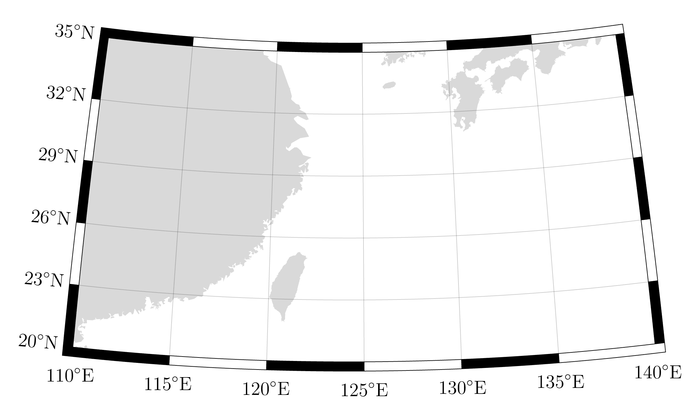

# WorldPolygonPlots

Wolfram Language/Mathematica tools for high quality plots of densities supported on geopolygons. 

## FancyGeoFrame

`FancyGeoFrame.wl` is a small package which provides the function `FancyGeoFrame`. This allows for the construction of a frame of alternating black and white boxes with labelled longitude and latitude coordinates suitable for use with `GeoGraphics`. 

### Quickstart

Ensure that [`MaTeX`](http://szhorvat.net/pelican/latex-typesetting-in-mathematica.html) is installed. If you don't want to use MaTeX, replace the function `GeoTick` inside the package with a function mapping longitudes/latitudes to strings.

Copy the file `FancyGeoFrame.wl` into your working directory and load it as follows

```mathematica
SetDirectory[NotebookDirectory[]];
<<FancyGeoFrame`
```

Then, we can construct a frame.

```mathematica
ticksX={110,115,120,125,130,135,140};
ticksY={20,23,26,29,32,35};

{frame,newrange} = FancyGeoFrame[ticksX, ticksY, 
    FancyBoxesSize->{{0.5,0.5},{0.45,0.45}},
    FancyTicksPadding->{2,3},
    FancyTicksMag->2.5, 
    FancyTicksAngle->{0,-5}*Pi/180,
    FancyTicksYDelta->0.2];

world={
    GeoStyling[Opacity[1]], 
    FaceForm[LightGray], 
    EdgeForm[None], 
    CountryData["World", "Polygon"]
    };

GeoGraphics[
	Join[world,frame],
	GeoRange->Reverse[newrange],
	GeoRangePadding->{None,None},
	GeoBackground->None,
	GeoGridLines->None,
	ImageSize->1100
]
```


### Options

- `FancyBoxesSize -> {{left, right}, {bottom, top}}` specifies the width of the boxes on each side.
- `FancyTicksPadding->{bottom, left}` specifies how far away the tick  labels are from the frame.
- `FancyTicksMag->mag` specifies how large the tick labels are.
- `FancyGridlinesOpacity->op` specifies the opacity of the gridlines.
- `FancyTicksAngle->{bottom, left}` specifies the rotation of the labels. On the y axis, the labels are rotated uniformly and on the x axis they are rotated concentrically. This can make the labels look nicer if their angle roughly matches the angle of the gridlines. 
- `FancyTicksYDelta->delta` specifies the "slope" of the labels on the y axis. This can make the labels look nicer if the lower labels are too far away from the y axis.

## TPTPolygonPlots

Under construction.


